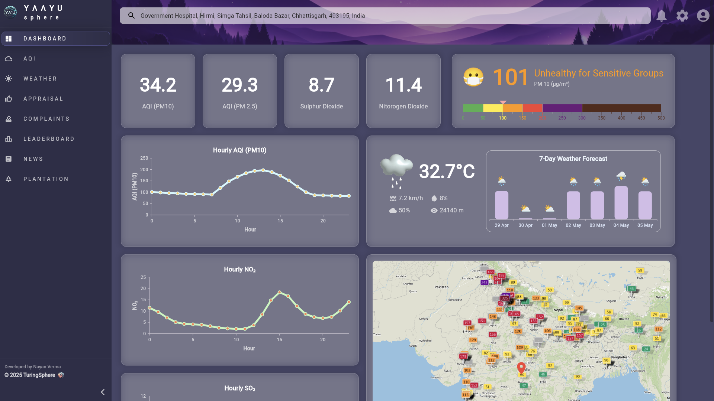

<p align="center">
  <h1>YaayuSphere</h1>
</p>

> “Breathe easy, dream big, and join us in transforming air quality monitoring into a mission of global impact!”

<p align="center">
  <a href="https://www.youtube.com/watch?v=LukRczQpt4o" target="_blank">
    
  </a>
</p>

<p align="center">
  <strong>▶️ Click to watch: <em>YaayuSphere – on YouTube
</p>


YaayuSphere isn’t just another Flutter app—it’s your gateway to a healthier planet, empowering communities and changemakers worldwide to visualize, understand, and act on air pollution data in real time. 🌍💙

---

## ✨ Why YaayuSphere Exists

Imagine a world where everyone—from curious students to seasoned environmentalists—can effortlessly access crystal-clear air quality insights and turn them into meaningful action. That’s the vision driving YaayuSphere:

> **“When we see the air we breathe in vivid detail, we’re inspired to protect it.”**

With sleek visuals, real-time updates, and a supercharged community spirit, YaayuSphere transforms complex data into powerful motivation. Whether you’re:
- A **developer** looking to contribute cutting-edge Flutter code,  
- An **activist** organizing clean-air campaigns,  
- A **teacher** inspiring the next generation of eco-heroes,  
- Or simply a **citizen** who cares—  

…YaayuSphere welcomes you. Let’s turn awareness into action, one interactive gauge at a time!

---


## 🛠️ Tech Stack

- **Frontend:** Flutter (Dart)  
- **Backend:** Firebase (Firestore, Authentication)  
- **Cloud Storage:** Cloudinary  
- **State Management:** Provider  
- **Mapping:** Google Maps API  
- **CI/CD:** GitHub Actions  
- **Design:** Figma  
- **Testing:** Flutter Test, Mockito  
- **Analytics:** Google Analytics for Firebase  
- **Push Notifications:** Firebase Cloud Messaging  

---


## 🚀 Features

- 🌫️ Real-time AQI Monitoring
- 📍 Location-based Air Quality Insights
- 📊 Custom AQI Gauges & Graphs
- 🌦️ Integrated Weather Information
- 🧪 Personal & Community Appraisals
- 🤝 Complaint Submission & Tracking
- 🏆 Environmental Leaderboards
- 📰 Air Quality News Aggregator
- 🌱 Plantation Initiative Dashboard

---
## 📸 Screenshots

### 🏠 Home Dashboard


.png)  
The central hub showing real-time air quality indicators, a map showing realtime AQI from multiple machines deployed across globe and a quick weather insights.

---

### 📍 AQI Tracker
.png)  
Track Air Quality Index levels with dynamic gauges and bar charts, and give insights into multiple weather parameters like AQI (PM10), AQI (PM2.5), CO2, CO, NO2, SO2.

---

### 🌦️ Weather Overview
.png)  
Get a detailed view of current weather conditions including temperature, humidity, wind, weather forecast, dew point and precipitation.

---

### 🧪 Appraisal Module
.png)  
Appraise the ones who are constantly working in the direction of improving the environment and encourage them, this module is a showcase of their effors.

---

### 🗣️ Complaint Portal
.png)


Easily report air pollution issues or environmental hazards to local authorities via an intuitive form interface.

---

### 🏆 Leaderboard
.png)  

.png)  
This provides a brief view of the top polluted cities and the countries across the globe.

---

### 📰 News Feed
.png)  
Stay updated with the latest environmental news, climate reports, and eco-friendly lifestyle tips.

---

### 🌱 Plantation Drive
.png)

.png)
Track community-driven plantation efforts, view progress, and participate in creating greener spaces.


## 🚀 Getting Started

Ready to supercharge the fight for cleaner air? Here’s how to jump in:

```bash
# 1. Clone your future:
git clone https://github.com/nayan1306/vaayusphere.git
cd vaayusphere

# 2. Ignite dependencies:
flutter pub get

# 3. Launch your preview:
flutter run           # on your device
flutter run -d chrome # on the web
```

---

## 🤝 Contributing

We welcome contributions from developers, designers, and enthusiasts! Here’s how you can contribute:

1. **Fork the Repository**  
   - Click the "Fork" button at the top-right corner of this repository.

2. **Create a Feature Branch**  
   - Use a descriptive name for your branch, e.g., `feature/add-dark-mode`.

3. **Make Your Changes**  
   - Ensure your code follows the project's coding standards.  
   - Write tests for any new functionality.

4. **Submit a Pull Request**  
   - Provide a clear description of your changes.  
   - Link any related issues in your PR description.

Check out our [CONTRIBUTING.md](CONTRIBUTING.md) for detailed guidelines.

---

## 📜 License

This project is licensed under the MIT License. See the [LICENSE](LICENSE) file for details.

---

## 🌟 Acknowledgments

Special thanks to the open-source community and all contributors who make this project possible. Together, we can breathe easier!
